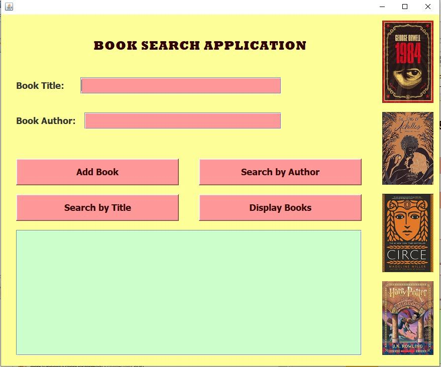
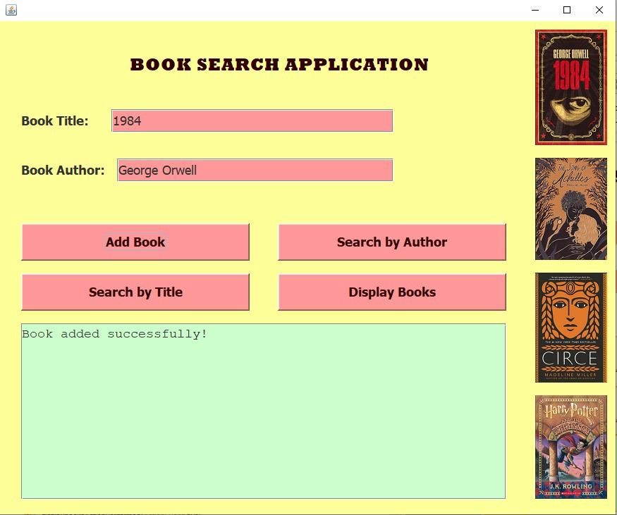
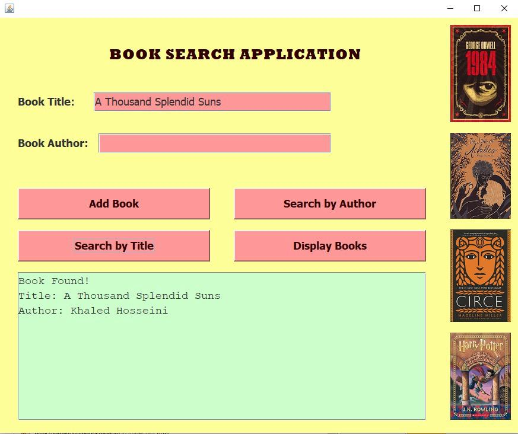
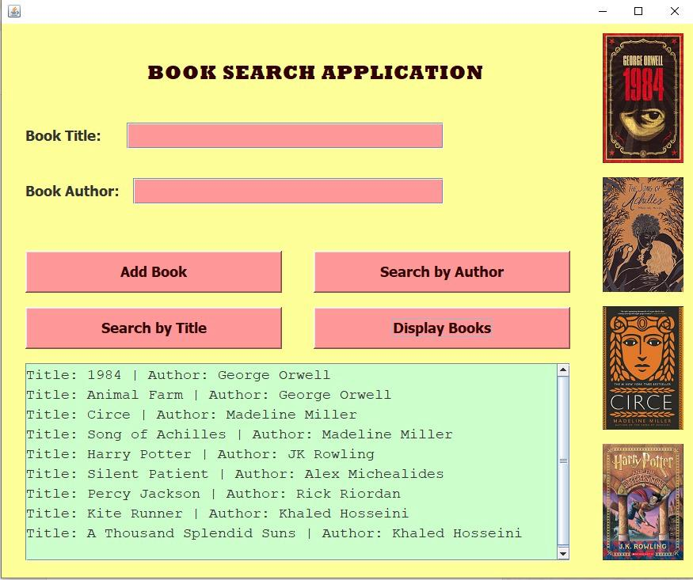

# Book Search Application

A Java Swing application for adding, searching, and displaying book records.

## Features

- Add new books with title and author
- Search for books by title
- Search for books by author
- Display all added books
- Simple Java Swing graphical interface

## Technologies Used

- Java
- Java Swing
- Object-Oriented Programming
- Arrays

## How It Works

The application stores book records using an array of `book` objects.

Users can:
1. Enter a book title and author and add the book.
2. Search for a book by its title.
3. Search for a book by its author.
4. Display all books that have been added.

## Screenshots

### Main Interface

### Adding a Book

### Searching by Title

### Searching by Author

### Displaying Books

## Files

- `myframe.java` – Contains the main Swing interface and application functions.
- `book.java` – Contains the book class used to store book title and author.
